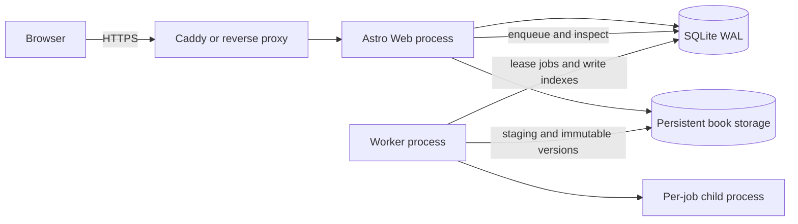

# M1 architecture: MinerU public publishing

- Status: Implemented and verified for M1; M2a library/reading loop implemented
- Date: 2026-07-25
- Scope: M0 foundations required by the first MinerU vertical slice, plus M1 import,
  preview, compile, search, publish, read, and original ZIP download
- Governing decisions: D-019～D-025, D-042～D-100

## 1. System boundary

M1 is one deployable application on one Linux host. It has two long-running processes from
the same codebase and two persistence mechanisms:



The Web process owns HTTP, authentication, authorization, cache and indexing headers, upload
streaming, previews, task control, and published reads. The worker owns expensive import and
build work. SQLite and the persistent filesystem are the only cross-process coordination
surfaces.

M1 does not introduce Redis, an external queue, object storage, a separate API service, a
second database, or multiple Web/worker instances.

For local preview, D-098 adds a repository launcher and a Compose override, not a new
runtime topology. `./docker/local.sh` manages the same separate Web and worker processes as
one `mirawind-local` Compose project, publishes Web only on `127.0.0.1:4321`, and omits
Caddy for localhost HTTP. The existing production Compose and HTTPS proxy remain the
authoritative deployment boundary.

## 2. Authority and derived data

| Data                     | Authority                          |                       Mutable? |          Rebuildable? |
| ------------------------ | ---------------------------------- | -----------------------------: | --------------------: |
| Markdown                 | Imported source                    |   Only by a new import/version |                    No |
| `book.yaml`              | Portable publishing configuration  | Through atomic config revision |                    No |
| Original MinerU ZIP      | Registered original file           | No, replace with a new version |                    No |
| AST                      | Compiler memory                    |              No persisted copy |                   Yes |
| `document-manifest.json` | Derived version manifest           |                      Immutable |                   Yes |
| HTML and reading assets  | Derived version output             |                      Immutable |                   Yes |
| FTS5 rows                | Derived version index              |                 Version-scoped |                   Yes |
| Book presentation row    | Derived bounded display projection |                 Version-scoped |                   Yes |
| Job/session/book state   | SQLite                             |                  Transactional | Not solely from books |

`book.yaml`, manifest and the internal `version.json` complete marker use independent
schemas in `docs/schemas/`. SQLite may cache metadata needed for routing and queries, but it
must not become a second editable copy of publishing configuration.

## 3. Persistent layout

```text
data/
├── db/
│   └── mirawind.sqlite
├── books/
│   └── <book_id>/
│       ├── draft/
│       │   ├── source/<source_id>/
│       │   ├── originals/<file_id>
│       │   ├── configs/<revision>/book.yaml
│       │   └── previews/<revision>/{pages,assets,diagnostics}/
│       ├── quarantine/
│       │   └── <version_id>/
│       └── versions/
│           └── <version_id>/
│               ├── version.json
│               ├── book.yaml
│               ├── document-manifest.json
│               ├── source/
│               │   ├── main.md
│               │   └── resources/
│               ├── originals/
│               │   └── <uploaded-mineru.zip>
│               └── published/
│                   ├── pages/
│                   └── assets/
├── staging/
│   └── <job_id>/
└── tmp/
    └── uploads/
        └── <upload_id>.part
```

`staging` and `versions` must share a filesystem so their final rename is atomic. Version
directories are never directly exposed as a static Web root. `version.json` records the
compiler version, schema versions, config revision, build time, manifest hash, and a complete
build marker.

## 4. Core SQLite responsibilities

The concrete schema belongs in the M1 data model, but it must represent:

- the unique administrator identity and authentication library tables;
- books and the sole `current_version_id`;
- immutable book versions with `ready`, `published`, `superseded`, `failed`, and `corrupt`
  lifecycle states; active builds exist only as jobs plus staging directories;
- durable jobs, leases, heartbeat, attempt count, error category, and captured base/config
  revision;
- FTS5 trigram rows scoped by book, version, page, and block;
- a small normalized title/author/heading table for one- and two-character fallback;
- one bounded `book_version_presentations` row per immutable version, derived from its
  validated `book.yaml` and manifest and committed atomically with ready/search rows;
- an audit trail for bootstrap, recovery, publish, rollback, visibility, and Passkey changes.

Search queries must join or otherwise enforce both book visibility and
`books.current_version_id`. Committed `ready`, old, or orphaned FTS rows must never become
public results.

The public `/library` and `/books/:bookKey` routes read only current public presentation
rows. Draft title caches and administrator lifecycle state never enter cacheable HTML;
`/api/manage/library` adds them after authorization with `private, no-store`. Numeric book
keys redirect only after resolving and authorizing the current projection.

## 5. Authentication and authorization

Authentication uses a maintained authentication library with database sessions, the Passkey
plugin, and password fallback. The public runtime permanently disables sign-up.

The offline CLI:

1. creates the sole administrator if none exists;
2. reads secrets from a TTY rather than arguments, environment, or logs;
3. uses the authentication library to create the password account;
4. writes the resulting user ID as the only authorized administrator.

The Astro middleware resolves sessions into request-local state. Resource services then apply
authorization:

- public current book content: anonymous allowed;
- draft/private content and all administration: sole administrator only;
- an anonymous request for a private or nonexistent book resource: indistinguishable `404`;
- API authentication failure: JSON `401`; authenticated non-owner: `403`.

Passkey registration, rename, and deletion require a real session created by server-side
authentication within the previous five minutes. Fallback passwords are 16–128 characters.
Deleting the final Passkey additionally verifies that password during the operation.
Offline complete recovery sets a new password, revokes sessions, and deletes all Passkeys
without exposing an HTTP recovery endpoint.

## 6. Upload and hostile archive handling

The Web process streams uploads to a uniquely created temporary file and counts actual bytes.
It never buffers a complete ZIP in memory. After the upload reaches durable storage, it
creates a durable import job.

Before and during extraction, the worker must:

- treat `/`, `\`, drive letters, UNC prefixes, NUL, `.`, `..`, empty components, and Unicode
  normalization collisions as security-relevant;
- convert accepted entry names to one internal POSIX-relative representation;
- reject absolute paths, traversal, duplicate normalized paths, symlinks, hardlinks, devices,
  FIFOs, sockets, encrypted entries, multi-disk archives, and unsupported compression;
- keep every open/write operation beneath a pre-opened unique staging root;
- enforce D-065～D-075 against actual bytes, entries, pixels, components, paths, elapsed
  time, and expansion ratio;
- read image metadata under decoder limits before any full decode;
- terminate and remove the entire staging root on any violation.

The original uploaded ZIP is copied into the immutable version only after its stream hash and
size are known. The normalized source tree retains only the main Markdown and referenced
resources needed to rebuild the public book; intermediate MinerU debug artifacts do not enter
the runtime source tree.

## 7. Main Markdown selection

The worker recursively enumerates ordinary `.md` files after safe extraction. It ignores
platform junk only for candidacy, not resource-limit counting.

Candidate scoring uses:

- exact `full.md` and expected MinerU companion files;
- `<stem>.md` patterns from CLI packages;
- referenced-resource integrity relative to the candidate directory;
- non-empty Markdown and parse diagnostics;
- evidence that candidates belong to one book rather than a multi-book bundle.

A unique error-free high-confidence candidate proceeds automatically. A generic single
Markdown requires administrator confirmation. Multiple book roots or ambiguous high-value
candidates stop before preview. The chosen Markdown's directory is the resource base.

## 8. Compile and preview pipeline

The per-job child process performs:

1. safe extraction and candidate discovery;
2. Markdown parsing and sanitized raw-HTML handling;
3. transient AST and normalized block tree creation;
4. stable block ID assignment or reliable inheritance;
5. automatic TOC and page-boundary suggestions;
6. administrator preview of TOC inclusion, display titles, display levels, roles, and
   title-boundary page splits;
7. atomic `book.yaml` revision creation;
8. semantic HTML, KaTeX, code highlighting, resource variants, manifest, and search records;
9. schema, link, hierarchy, page, resource, checksum, and search consistency validation.

Raw HTML is not trusted. A maintained sanitizer must use an explicit allowlist for semantic
elements and safe attributes, remove scripts/event handlers, reject unsafe URL protocols,
and route accepted local resources through the versioned resource map.

The administrator cannot reorder body content in M1. TOC inclusion changes navigation only.
`display_title`, `display_level`, `role`, and `starts_page` never rewrite the imported
Markdown.

## 9. Atomic publication

The exact cutover is:

1. capture the base `current_version_id` and config revision when the job begins;
2. fully build and validate staging;
3. write and sync files, then atomically rename staging to `versions/<version_id>`;
4. sync the versions parent directory;
5. in one SQLite transaction, create the `ready` version, its bounded presentation
   projection and all version-scoped FTS rows;
6. validate FTS counts and identifiers; rollback on any failure;
7. in a short `BEGIN IMMEDIATE` transaction, compare the captured base/config revision,
   confirm `ready` and projection identity, update `current_version_id` plus the frozen
   current alias, transition version states, and complete the job.

There is no filesystem current pointer. Public version-specific routes must not expose a
`ready` version merely because its directory exists.

## 10. Worker and recovery

M1 runs one worker and one active import/build job globally. Job claims use an atomic SQLite
lease, a 10-second heartbeat, and a 60-second expiry. A job executes in a child process so the
worker can terminate the whole process tree at the 30-minute limit. Cancellation or timeout
first requests cooperative shutdown; after a fixed 10-second grace period the worker force
terminates the task process group and waits for confirmed closure before committing terminal
state.

On restart:

- expired `running` jobs become `interrupted`;
- incomplete staging is cleaned;
- an infrastructure-interrupted job may restart from the preserved ZIP once;
- validation, limit, content, and second-interruption failures require manual retry;
- `ready` versions remain unpublished until an administrator repeats the publish action.

Startup reconciliation inventories staging, version directories, version rows, and current
pointers. Unreferenced completed directories move to quarantine and are deleted after 24
hours. A missing/corrupt current version atomically rolls back to the newest verified
published predecessor; without one, only that book returns `503`.

## 11. Published read path

A reading request:

1. resolves the book and authorization;
2. reads `current_version_id` once;
3. derives the immutable version path;
4. reads pre-generated HTML and response metadata; immutable manifests may be reused from a
   bounded in-process cache keyed by version and manifest hash;
5. returns without parsing, rendering, image processing, or indexing.

The HTML references assets with a version ID or content hash so one page cannot mix resource
versions. Old published assets may remain accessible while the book is public to support
in-flight requests, but all historical resources become unauthorized when the book becomes
private.

## 12. Response policy matrix

| Response                       |          Anonymous | Cache-Control                                      |            Search indexing |
| ------------------------------ | -----------------: | -------------------------------------------------- | -------------------------: |
| Public HTML                    |            Allowed | `public, max-age=0, must-revalidate` + strong ETag |                    Allowed |
| Public versioned reading asset |            Allowed | `private, max-age=31536000, immutable`             |                   Via page |
| Public original download       |            Allowed | `private, no-store`                                | `X-Robots-Tag: noindex...` |
| Draft/private resource         |    Hidden as `404` | `private, no-store`                                |                  Forbidden |
| Login/manage/private API       | Admin or auth flow | `private, no-store`                                |                  Forbidden |
| Alias redirect                 |  As target permits | `no-store`                                         |      Canonical target only |
| Missing/hidden route           |              `404` | `no-store`                                         |                  Forbidden |
| Hashed site JS/CSS/font        |            Allowed | public one-year immutable                          |                Not content |

Authorization runs before conditional ETag or Range handling. Public HTML cannot vary by
administrator session; private controls load through non-cacheable authenticated endpoints.

Downloads use safe `Content-Disposition: attachment`, UTF-8 and ASCII filenames, exact
content type/length, `nosniff`, strong content hash ETag, and byte ranges. Every range request
rechecks current visibility.

## 13. Search

M1 uses FTS5 trigram with `detail=full` over normalized visible text. Query input receives the
same NFC/newline normalization, FTS5 literal-phrase encoding, and SQL parameter binding.

- 3+ Unicode code points: search metadata, headings, and body.
- 1–2 code points: bounded scan of book title, author, and current-version heading rows only.
- no full-body `LIKE`, `unicode61` Chinese primary index, native word-segmentation extension,
  or body unigram/bigram table in M1.

The UI states the short-query scope. Result URLs include book, page, and block identity.

## 14. Observability

Structured events include request/job IDs, book/version IDs, phase, durations, byte/entry
counts, exit category, and publish/recovery transitions. They exclude credentials, cookies,
Passkey material, full Markdown, private notes, and unsanitized archive names.

Required operational views:

- queued/running/interrupted/failed task counts and oldest age;
- worker lease and heartbeat status;
- import/build phase duration and failure category;
- staging/quarantine/version disk usage;
- publication rollback and startup reconciliation events;
- read latency p50/p95/p99 and response status;
- FTS build size/time and query latency by short/normal branch.

## 15. Performance and fixture gates

The uncached origin response for a public reading page must remain at or below 300 ms p95 on
the reference single-server deployment. The gate measures request handling only; build time
is reported separately and never blocks the published read path.

M1 acceptance uses:

- three registered, Git-ignored local MinerU 3.4.4 ZIP fixtures supplied by the
  administrator, including 583-page and 441-page representative large books plus one
  97-page compatibility book, identified in tracked evidence only by opaque ID, MinerU
  version, size and SHA-256;
- Cloud `full.md`, CLI `<stem>.md`, generic single Markdown, ambiguous multi-Markdown, and
  multi-book fixtures;
- missing/cross-directory resources and raw-HTML fixtures;
- traversal, link/special-file, duplicate-path, malformed archive, ZIP bomb, path, image,
  count, size, and timeout boundary fixtures;
- publication crash points before/after rename, FTS transaction, and current pointer commit;
- Chinese search fixtures from `docs/research/sqlite-fts5-chinese-short-query.md`;
- a 500-page synthetic stress fixture that provides a repeatable ordinary-CI pressure
  baseline without replacing the representative real large-book fixtures.

The final benchmark records import time, peak worker memory, extracted size, index
size/build time, idle and concurrent-build read percentiles, and normal/short search
percentiles for all three real fixtures and the stress fixture in
`docs/audits/m1-performance-report.md`. Every measured p95 passed its release gate.

## 16. Deferred from M1

- EPUB import
- highlighter selection/range and exact offset semantics
- notes, annotations, bookmarks, progress, and cross-device reading settings
- chapter body reordering and page alias editing
- complete library/folder management, recycle bin, homepage, and cover design
  (historical M1 deferral; D-107 later approved irreversible single-book deletion without a
  recycle bin)
- Chinese two-character body search beyond title/author/heading fallback
